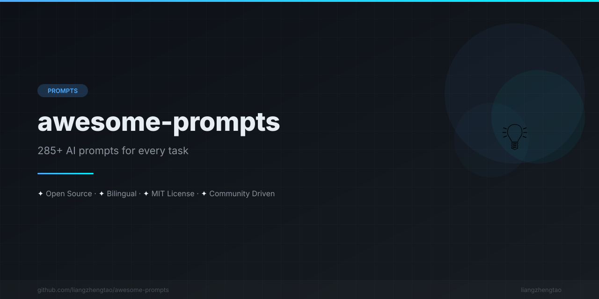

[English](README.md) | [中文](README.zh.md) | [日本語](README.ja.md) | [Français](README.fr.md) | [Español](README.es.md) | [العربية](README.ar.md) | [한국어](README.ko.md) | [Português](README.pt.md) | [Русский](README.ru.md) | [Deutsch](README.de.md)

<div align="center">



</div>


# 🚀 Awesome Prompts

**Более 150 проверенных ИИ-промптов для разработчиков, создателей и профессионалов. Копируй, вставляй, получай результат.**

---

<p align="center">
  
  
  
  
</p>

---


## 🤔 Почему Awesome Prompts?

### До (расплывчатый промпт) ❌

```
Напиши мне ревью кода
```

### После (точный промпт) ✅

```
Ты — старший инженер по безопасности, проведи аудит безопасности OWASP Top 10 для следующего кода.

Язык: Python
Фреймворк: Django
Код:
[вставьте ваш код]

Выведи в следующем формате:
1. 🔴 Критические уязвимости
2. 🟠 Высокие уязвимости
3. 🟡 Средние уязвимости
4. 🔵 Низкие уязвимости

Каждая проблема должна включать: описание, уровень риска, сценарий атаки, рекомендации по исправлению (с примером кода)
```

**Результат: вывод в 10 раз лучше. Каждый раз.**

---

## 📂 Категории

<table>
<tr>
<td width="50%">

### 💻 Программирование и разработка
| Файл промпта | Промпты |
|-------------|---------|
| [Ревью кода](prompts/编程开发/code-review.md) | Аудит безопасности, производительность, читаемость, архитектура |
| [Отладка](prompts/编程开发/debugging.md) | Анализ ошибок, stack trace, корневой причинный анализ |
| [Рефакторинг](prompts/编程开发/refactoring.md) | Извлечение метода, упрощение условий, оптимизация именования |
| [Документация](prompts/编程开发/documentation.md) | README, документация API, комментарии к коду |

</td>
<td width="50%">

### ✍️ Создание контента
| Файл промпта | Промпты |
|-------------|---------|
| [Написание блогов](prompts/内容创作/blog-writing.md) | Структура, крючки, SEO, заключение |
| [Социальные сети](prompts/内容创作/social-media.md) | Twitter, LinkedIn, Instagram, TikTok |
| [Email-последовательности](prompts/内容创作/email-sequences.md) | Приветственные цепочки, nurturing, продажи, реактивация |

</td>
</tr>
<tr>
<td width="50%">

### 💼 Бизнес и офис
| Файл промпта | Промпты |
|-------------|---------|
| [Бизнес-стратегия](prompts/商业办公/business-strategy.md) | SWOT, конкурентный анализ, исследование рынка |
| [Презентации](prompts/商业办公/presentation.md) | Слайды, заметки докладчика, Q&A |
| [Управление проектами](prompts/商业办公/project-management.md) | Требования, риски, отчёты, ретроспектива |

</td>
<td width="50%">

### 📚 Образование и обучение
| Файл промпта | Промпты |
|-------------|---------|
| [Помощник по учёбе](prompts/学习教育/study-assistant.md) | Объяснение концепций, карточки, тесты, учебный план |
| [Преподавание](prompts/学习教育/teaching.md) | Планы уроков, рубрики, обратная связь студентам |
| [Исследования](prompts/学习教育/research.md) | Обзор литературы, гипотезы, дизайн исследования |

</td>
</tr>
<tr>
<td colspan="2">

### 🎨 Креативный дизайн
| Файл промпта | Промпты |
|-------------|---------|
| [Генерация изображений](prompts/创意设计/image-generation.md) | Стилевые модификаторы, композиция, улучшение качества, негативные промпты (20+ шаблонов) |
| [Креативное письмо](prompts/创意设计/creative-writing.md) | Начало истории, создание персонажей, построение мира, диалоги (15+ шаблонов) |

</td>
</tr>
</table>

---

## 🚀 Быстрый старт

### 1. Просмотрите

Выберите категорию выше и найдите подходящий промпт.

### 2. Скопируйте

Скопируйте шаблон промпта и замените `[VARIABLES]` на вашу конкретную информацию.

### 3. Вставьте и получите результат

Вставьте в ваш любимый ИИ-инструмент (ChatGPT, Claude, Gemini и т.д.) и получите качественный результат.

---

## 📖 Как использовать

### Переменные

Все промпты используют `[VARIABLES]`, которые нужно заменить:

```
[TOPIC]       → ваша конкретная тема
[LANGUAGE]    → ваш язык программирования
[AUDIENCE]    → ваша целевая аудитория
[CODE]        → ваш реальный код
```

### Советы

1. **Будьте конкретны**: Чем больше контекста вы предоставите, тем лучше результат.

2. **Итерируйте**: Используйте первый вывод как отправную точку, затем улучшайте.

3. **Комбинируйте**: Смешивайте промпты из разных категорий для сложных задач.

4. **Настройте**: Измените промпты под ваш рабочий процесс и стиль.

---

## 🤝 Участие

Приветствуются вклады! Сначала прочтите [Руководство по вкладу](CONTRIBUTING.md).

### Спобы участия

- 🆕 Добавить новые промпты
- ✏️ Улучшить существующие промпты
- 🐛 Исправить ошибки или опечатки
- 🌍 Добавить переводы
- ⭐ Поделиться с другими

---

## 📊 Статистика

| Категория | Файлы | Промпты |
|----------------|-------------|-----------------|
| 💻 Программирование и разработка | 4 | 64 |
| ✍️ Создание контента | 3 | 50+ |
| 💼 Бизнес и офис | 3 | 48+ |
| 📚 Образование и обучение | 3 | 50+ |
| 🎨 Креативный дизайн | 2 | 35+ |
| **Итого** | **15** | **247+** |

---

## 📜 Лицензия

Проект распространяется под лицензией MIT — подробности в файле [LICENSE](LICENSE).

---

## ⭐ История звёзд

Если вам понравилось, поставьте нам звезду! ⭐

---

## 📬 Контакты

- **Issues**: [GitHub Issues](https://github.com/liangzhengtao/awesome-prompts/issues)
- **Обсуждения**: [GitHub Discussions](https://github.com/liangzhengtao/awesome-prompts/discussions)

---

<p align="center">
  Создано с ❤️ сообществом<br>
  <a href="#top">Наверх ↑</a>
</p>

---
